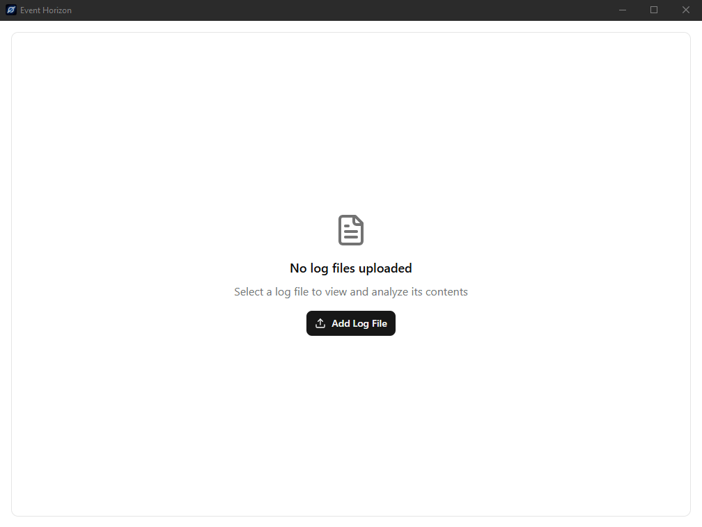

<h1 align="center">Event Horizon</h1>

A desktop application for viewing Serilog log files in a tail-like fashion. Built with Wails.

## Why Event Horizon?

Because `tail -f` is great, but lacks structure. Event Horizon brings the power of Serilog's structured logging to your desktop in a convenient, real-time view.  Stop grepping, start *seeing*.

## Features

*   **Real-time Log Viewing:**  Continuously monitors and displays new log entries as they are written.
*   **Serilog Support:** Parses and displays Serilog's structured log data.
*   **Filtering:** Filter logs based on level, source, or any other property.
*   **Cross-Platform:** Runs on Windows, macOS, and Linux thanks to Wails.

## Installation

Use one of the pre built binaries from the releases (currently only Windows installer, more to come) 

or

build manually:

1.  Clone the repository.
2.  [Install Go](https://go.dev/doc/install)
3.  [Install Wails](https://wails.io/docs/gettingstarted/installation)
4.  Run `wails build` in the root `event-horizon` directory of the repository.
5.  Run the executable.

## Usage

1.  Launch Event Horizon.
2.  Select log file
3.  Start viewing logs!

