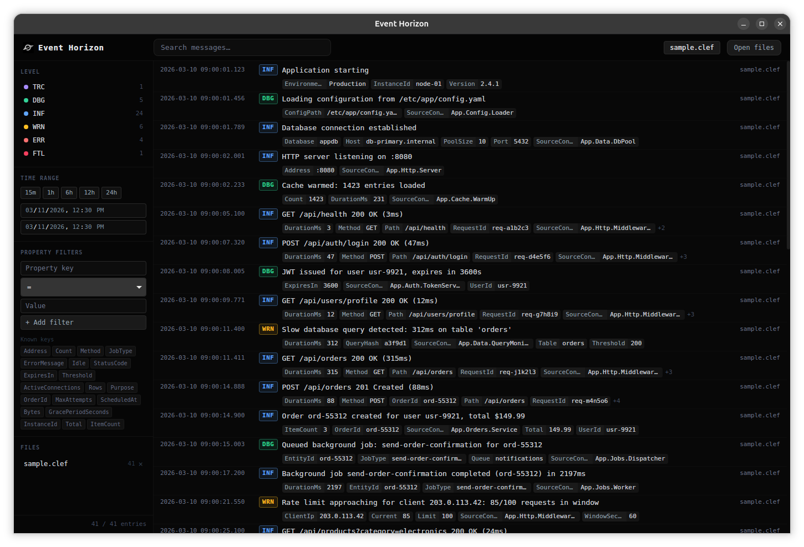
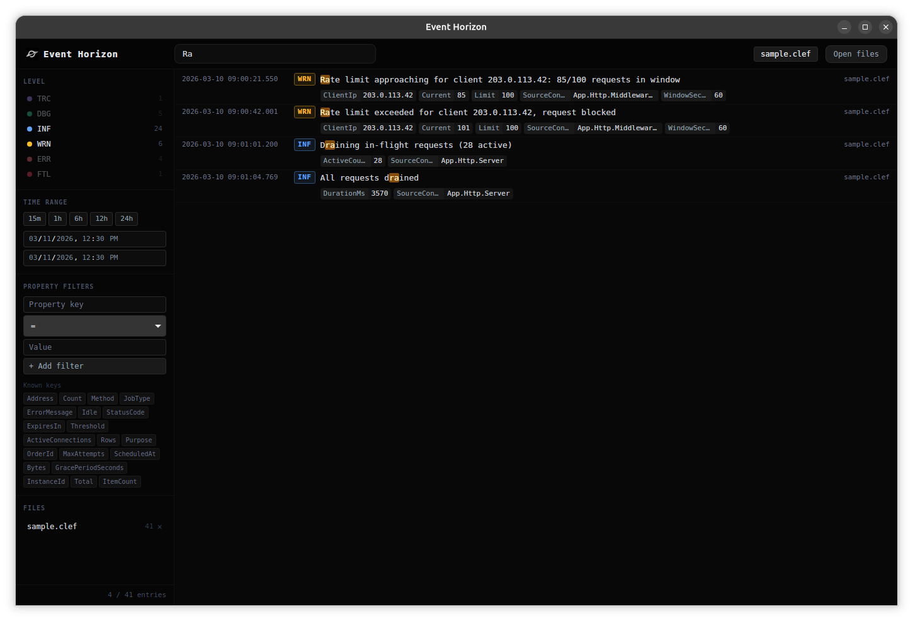
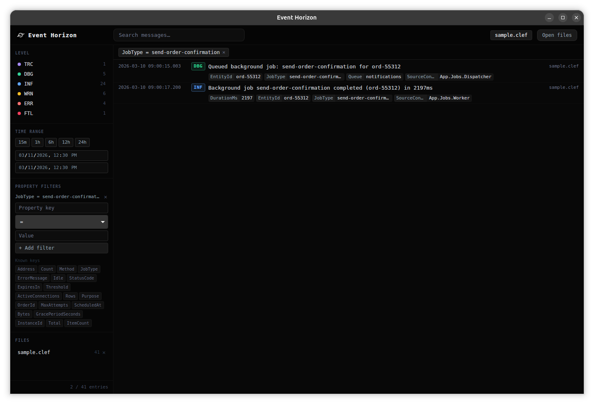
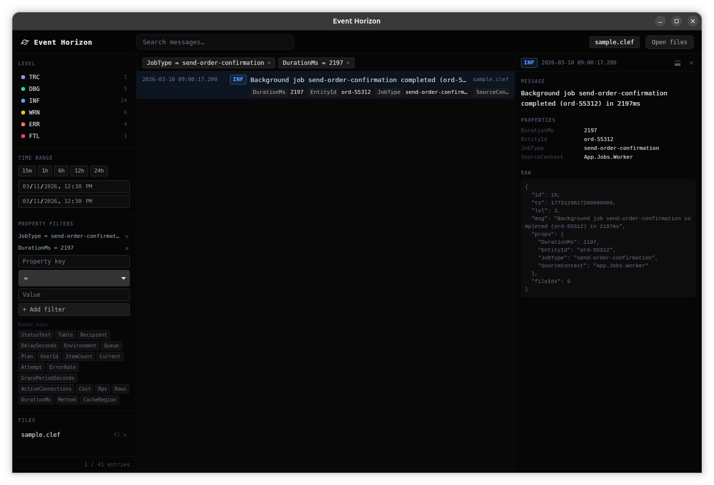

# Event Horizon

A desktop log viewer with support for:
- Serilog CLEF (Compact Log Event Format) files. 
- Log4X files with automatic log pattern detection

## Features

**Search**: filter entries by message text with inline match highlighting.

**Property filters** — filter by structured property key and value. Active filters appear as chips above the log list.

**Detail panel**: click an entry to see its full message, properties, and raw JSON. Dockable to the right or bottom.

**Live tail**: new entries are streamed in as they are written to the file.

## Installation

Download a pre-built binary from the [releases page](../../releases), or build from source:

1. Install [Go](https://go.dev/doc/install) and [Wails](https://wails.io/docs/gettingstarted/installation)
2. Clone the repository
3. Run `wails build` inside the `event-horizon` directory

---

Built with ♥️ and [Wails](https://wails.io/).
